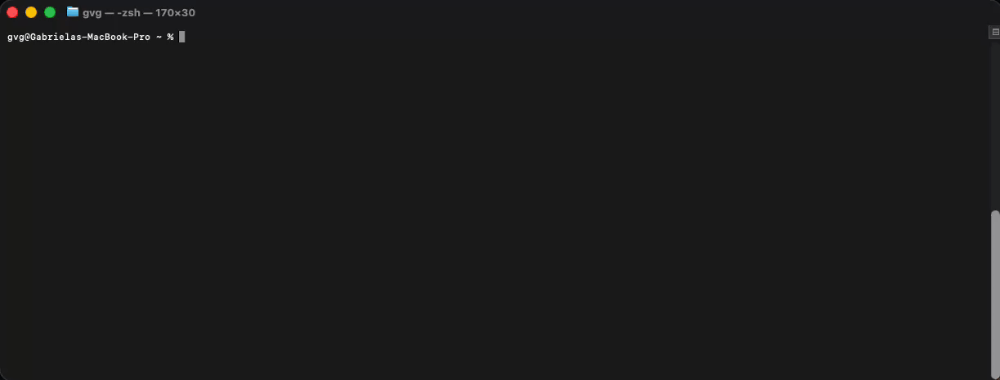

# BadRobot


[](https://github.com/controlplaneio/badrobot/actions/workflows/security_analysis.yml)
[](https://goreportcard.com/report/github.com/controlplaneio/badrobot)


*Validate Kubernetes Operator resources for security risks.*

BadRobot is a tool to perform security auditing of Kubernetes Operators. Operators are software extensions to Kubernetes that make use of custom resources to manage applications and their components. Operators follow Kubernetes principles, notably the control loop. These extensions usually run within the Kubernetes cluster, but they could just as well interact with the cluster from the outside with appropriate authentication.

BadRobot statically analyses Operator manifest files for high risk configurations such as lack of security restrictions on the deployed controller and the permissions of an associated RBAC ClusterRole. The risk analysis that BadRobot evaluates is primarily focussed on the likelihood that a compromised Operator would be able to carry privilege escalation and obtain full control over every resource in the cluster and in all namespaces.

- [Quick Start](#-quick-start)
- [Installation](#-installation)
  - [Go (1.17+)](#go-117)
  - [Download from GitHub Releases](#download-from-github-releases)
  - [Build from Source](#build-from-source)
  - [Docker Image](#docker-image)
- [Usage Examples](#-usage-examples)
  - [Scanning](#scanning)
  - [Output Formats](#output-formats)
  - [Scan Options](#scan-options)
- [Rulesets](#-badrobot-rulesets)

## 🎬 Demo



## 🚀 Quick Start

> **Note:** BadRobot requires the Operator manifests to be bundled into a single file, rather than scanning an entire directory structure and analysing individual manifests.

### 1. Prepare Your Manifest

Bundle your Kubernetes Operator YAML resources into a single file (e.g., `operator.yaml`). For a quick test, you can save the following overly permissive `ClusterRole` to a file:

```bash
$ cat <<EOF > operator.yaml
apiVersion: rbac.authorization.k8s.io/v1
kind: ClusterRole
metadata:
  name: example-operator
rules:
- apiGroups:
  - "*"
  resources:
  - "*"
  verbs:
  - "*"
EOF
```

### 2. Run Your First Scan

Execute the scan against your bundled manifest file:

```bash
# Using the local binary
badrobot scan ./operator.yaml

# Or using Docker
docker run -i controlplane/badrobot scan /dev/stdin < operator.yaml

# Using the local binary with human-readable table output format
badrobot scan ./operator.yaml --format table
```

BadRobot will output a security analysis of the Operator, highlighting risky permissions and misconfigurations.

## 📦 Installation

BadRobot can be run either as a container or as a local Go binary.

### Go 1.17+

```bash
go install github.com/controlplaneio/badrobot@latest
```

### Download from GitHub Releases

Navigate to the [BadRobot Releases](https://github.com/controlplaneio/badrobot/releases) page and download the `.tar.gz` file corresponding to your operating system and architecture.

```bash
# Extract the archive (replace with your specific filename)
tar -xzf badrobot_<os>_<arch>.tar.gz

# Make the binary executable
chmod +x badrobot

# Move the binary to your PATH
sudo mv badrobot /usr/local/bin/
```

### Build from Source

```bash
git clone https://github.com/controlplaneio/badrobot.git
cd badrobot
make build
```

### Docker Image

You can use the BadRobot [Docker image](https://hub.docker.com/r/controlplane/badrobot) to run BadRobot as a container, e.g.:

```bash
docker run -i controlplane/badrobot scan /dev/stdin < operator.yaml
```

## 📖 Usage Examples

### Scanning

Scan Kubernetes Operator resources (YAML or JSON):

```bash
# Scan a specific operator YAML file locally
badrobot scan ./operator.yaml

# Scan a local file using its absolute path
badrobot scan /full/path/to/operator.yaml --absolute-path

# Scan a file via Docker using standard input
docker run -i controlplane/badrobot scan /dev/stdin < operator.yaml
```

### Output Formats

Customise the format and destination of your scan results:

```bash
# JSON output (default behaviour)
badrobot scan ./operator.yaml --format json

# Table output
badrobot scan ./operator.yaml --format table

# Save output to a specific file location
badrobot scan ./operator.yaml --output results.json

# Use a custom template for the output
badrobot scan ./operator.yaml --format template --template report-template.tmpl
```

#### Example JSON Output

```json
[
  {
    "object": "ClusterRole/example-operator.default",
    "valid": true,
    "fileName": "./operator.yaml",
    "message": "Failed with a score of -20 points",
    "score": -20,
    "scoring": {
      "critical": [
        {
          "id": "ImpersonateClusterRole",
          "selector": ".rules .apiGroups .resources .verbs",
          "reason": "The Operator SA cluster role has impersonate permissions",
          "points": -20
        }
      ]
    }
  },
  ...
]
```

#### Example Table Output


### Scan Options

Configure schemas, error handling, and logging:

```bash
# Set a custom directory for JSON schemas
badrobot scan ./operator.yaml --schema-dir /path/to/schemas

# Override the default exit code (2) on failure
badrobot scan ./operator.yaml --exit-code 1

# Turn on debug logs for troubleshooting
badrobot scan ./operator.yaml --debug
```

## 🤖 BadRobot Rulesets

| RuleSet ID | Rule | Risk | Risk Level |
|------------|------|------|------------|
| OPR-R1-NS | default Namespace | The Operator is deployed onto the default namespace. Operators should be deployed into a dedicated namespace to reduce the exposure of other sensitive information or workloads in the event of compromise. The default namespace is where applications and services are deployed if the namespaces is not specified. A compromised application container could pivot to the Operator which may allow an adversary to obtain cluster wide permissions. | Low |
| OPR-R2-NS | kube-system Namespace | The Operator is deployed onto the kube-system namespace. Operators should be deployed into a dedicated namespace to reduce the exposure of other sensitive information or workloads in the event of compromise. The kube-system namespace is reserved for Kubernetes engine and the Operator should not be deployed here. | High |
| OPR-R3-SC | No securityContext | The Operator is deployed without a securityContext. In the event the Operator is compromised, the adversary could have unrestricted access to resources on the underlying host. Unless the Operator is performing highly permissive cluster configuration and management of resources, it is highly recommended that some restrictions be applied. | High |
| OPR-R4-SC | securityContext set to allowPrivilegeEscalation: true | The Operator is deployed with privilege escalation permissions which in the event of a compromise would allow adversary root access to the underlying host. By default, the Operator-SDK sets allowPrivilegeEscalation: false and must be explicitly removed or modified in the deployment manifest. | High |
| OPR-R5-SC | securityContext set to privileged: true | The Operator is deployed with all of the system root’s capabilities. In the event the Operator is compromised, the Adversary would have unrestricted access to resources on the underlying host.  | Critical |
| OPR-R6-SC | securityContext set to readOnlyRootFilesystem: false | The Operator is deployed with write access to the underlying host. In the event the Operator is compromised and the Operator has mount access, an adversary would be able to write to root filesystem to obtain full system compromise. | Medium |
| OPR-R7-SC | securityContext set to runAsNonRoot: false | The Operator is configured to run as root. If the Operator has access to the underlying host it will have the same access as host root account. By default, the Operator-SDK sets runAsNonRoot: true and must be explicitly removed or modified in the deployment manifest. | High |
| OPR-R8-SC | securityContext set to runAsUser: 0 | The Operator is configured to run as root. If the Operator has access to the underlying host it will have the same access as host root account. By default, the Operator-SDK sets runAsNonRoot: true and must be explicitly removed or modified in the deployment manifest. | High |
| OPR-R9-SC | securityContext adds CAP_SYS_ADMIN Linux capability | The Operator is configured with CAP_SYS_ADMIN enabled, removing any previously dropped Linux capabilities. CAP_SYS_ADMIN is an overloaded capability allowing system administrative operations and can lead to privilege escalation on the host if the Operator is compromised. | Critical |
| OPR-R10-RBAC | Runs as Cluster Admin | The Operator runs as default cluster role, cluster admin. Even if the Operator requires full cluster administration, this role should not be used and a dedicated role created instead. It is recommended that the permissions of the Operator are reviewed and redefined. | **Critical** |
| OPR-R11-RBAC | ClusterRole has full permissions over all resources | The Operator runs with a cluster role with full access (\*) to all resources (\*). Even if the Operator requires full cluster administration, the cluster role should explicitly define apigroups, resources and verbs it requires access to. It is recommended that the permissions of the Operator are reviewed and redefined. | **Critical** |
| OPR-R12-RBAC | ClusterRole has full permissions over all CoreAPI resources  | The Operator runs with a cluster role with full access (\*) to CoreAPI resources (\*). Even if the Operator requires full access to all CoreAPI resources, the cluster role should explicitly define resources and verbs it requires. It is recommended that the permissions of the Operator are reviewed and redefined. | **Critical** |
| OPR-R13-RBAC | ClusterRole has full permissions over ClusterRoles and ClusterRoleBindings | The Operator runs with a cluster role which has unrestricted access to ClusterRoles and ClusterRoleBindings. In the event of a compromise, an adversary would be able to rebind the Operator service account with full access to cluster wide resources. | High |
| OPR-R14-RBAC | ClusterRole has access to Kubernetes secrets | The Operator is deployed with access to all secrets across the cluster. Accessing this level of cluster wide secrets may allow an adversary a method of privilege escalation. It is highly recommended that a dedicated role is used to access specific secrets the Operator requires to manage and use. | High |
| OPR-R15-RBAC | ClusterRole can exec into Pods | The Operator is deployed with a cluster role that allows remote access to any Pod in the cluster. In the event the Operator is compromised, the adversary would be able to pivot to different containers to attempt to escape isolation or access sensitive information. | High |
| OPR-R16-RBAC | ClusterRole has escalate permissions | The Operator is deployed with the escalation privilege, allowing the cluster role grant privileges beyond the permissions that are bound to the Operator. Due to this reason, it is recommended that Operators are not given the escalate privilege. | High |
| OPR-R17-RBAC | ClusterRole has bind permissions| The Operator is deployed with the bind privilege, allowing the cluster role to create bindings of roles beyond the permissions granted to the Operator. Due to this reason, it is recommended that Operators are not given the bind privilege.  | High |
| OPR-R18-RBAC | ClusterRole has impersonate permissions | The Operator is deployed with the impersonate privilege, allowing the cluster role to gain the rights of another role. This permission would allow an adversary (with access to the Operator) to masquerade as another as another role to perform malicious actions on cluster resources. Due to this, it is recommended that Operators are not given the impersonate privilege. | Critical |
| OPR-R19-RBAC | ClusterRole can modify pod logs | The Operator is deployed with full permissions over pod logs. The permission can be abused by an adversary to remove or overwrite pod logs masking malicious actions performed against pod resources. | Low |
| OPR-R20-RBAC | ClusterRole can remove Kubernetes events | The Operator is deployed with access to deleting Kubernetes events. In the event the Operator is compromised, an Adversary would be able to remove Kubernetes events and hide previous malicious actions. | Low |
| OPR-R21-RBAC | ClusterRole has full permissions over any custom resource definitions | The Operator is deployed with full permissions over any custom resource definition, allowing the modification of custom resources managed by another Operator. The cluster role or role must only be scoped to custom resources managed by the Operator. In the event the Operator is compromised or a malicious Operator is deployed, it would allow an adversary to manipulate custom resources. | High |
| OPR-R22-RBAC | ClusterRole has full permissions over admission controllers | The Operator is deployed with full permissions over Kubernetes admission controllers which can allow an adversary to read or modify submitted resources. | High |
| OPR-R23-RBAC | ClusterRole has permissions over service account token creation | The Operator has full permissions over cluster wide service accounts, allowing the creation of token requests for existing service accounts. This can be abused by an adversary to masquerade as another user to access cluster resources. | High |
| OPR-R24-RBAC | ClusterRole has read, write or delete permissions over persistent volumes | The Operator is deployed with read, write or delete permissions for volume mount, allowing root filesystem access and exposing sensitive information. | High |
| OPR-R25-RBAC | ClusterRole has modify permissions over network policies | The Operator is deployed with access to cluster wide network policies, allowing the modification of network routes. An adversary can leverage these permissions to access unauthorised resources. | Medium |
| OPR-R26-RBAC | ClusterRole has permissions over the Kubernetes API server proxy | The Operator is deployed with permissions over the proxy sub resource of the node, allowing command execution on every pod on the node via the Kubelet API. An adversary can leverage this permission on the Operator to run custom workloads on several pods on the node. | High |
| OPR-R27-RBAC | ClusterRole has modify permissions over namespaces | The Operator is deployed with permissions to modify labels on Namespace objects. In clusters where Pod Security Admission is used, an adversary might leverage this permission on the operator to configure the namespace for a more permissive policy than intended by the administrators. For clusters where NetworkPolicy is used, the permission may be abused to set labels that indirectly allow access to services that an administrator did not intend to allow. | High |
| OPR-R28-NS | Pod Security Standard Baseline profile or stricter should be enforced for Operator namespace | Enforcing a 'baseline' or 'restricted' Pod Security Standards (PSS) profile for the Operator namespace limits the use of containers with access to underlying cluster nodes, via mechanisms like privileged containers, or the use of hostPath volume mounts. | High |

---

Made with ❤ by [ControlPlane](https://control-plane.io/)
